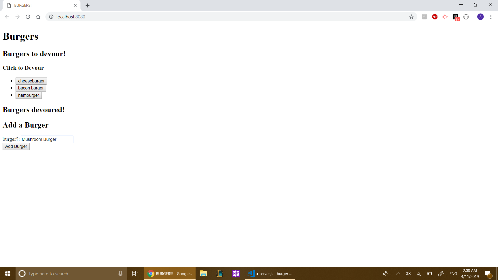
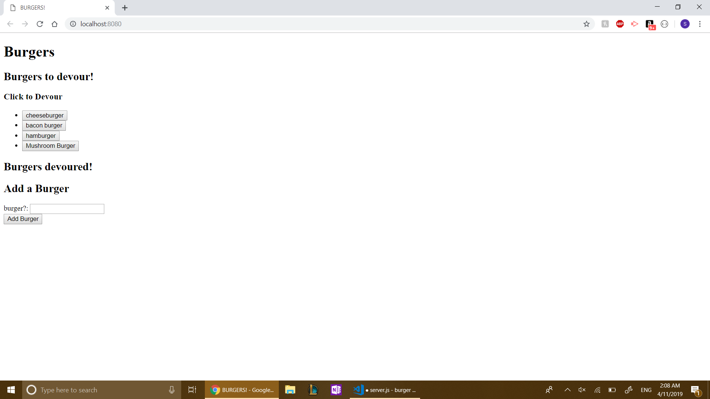
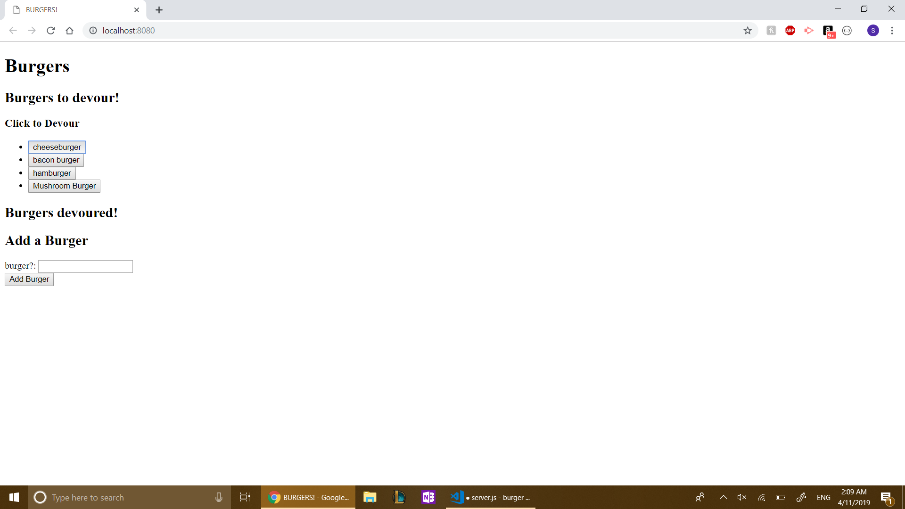
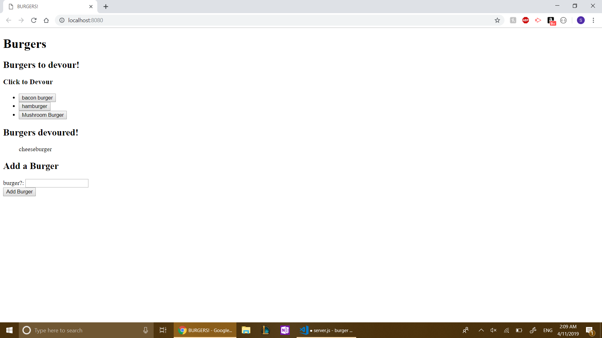

# Eat-Da-Burger

A full-stack Node.js exercise for creating and "devouring" burgers. Records are
stored in MySQL, rendered with Handlebars, and updated through an Express API.

## Features

- List burgers waiting to be eaten
- Add a new burger
- Mark a burger as devoured
- Persist state in MySQL
- Custom model and ORM layers over the `mysql` package

## Technology

- Node.js and Express
- MySQL
- Express Handlebars
- jQuery and AJAX

## Setup

```bash
npm install
mysql -u root -p < db/schema.sql
mysql -u root -p burgers_db < db/seeds.sql
```

Update the local database settings in `config/connection.js`, or provide a
`JAWSDB_URL` environment variable.

```bash
npm start
```

Open `http://localhost:8080`.

## Routes

| Method | Route | Purpose |
| --- | --- | --- |
| `GET` | `/` | Render all burgers |
| `POST` | `/api/burgers` | Add a burger |
| `PUT` | `/api/burgers/:id` | Mark a burger as devoured |

## Screenshots






## Project Status

This is a legacy coursework project. The create and update flows are supported;
the unused delete route is incomplete.
